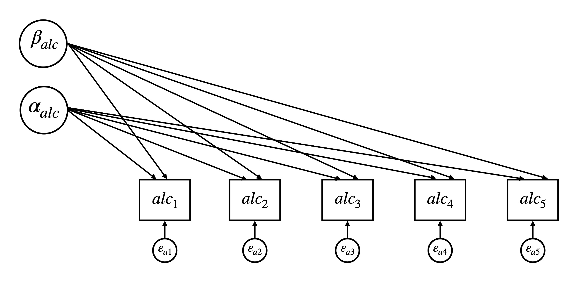

---
---
# Latent Curve Model with Structured Residuals
{: .no_toc}
## A tutorial by Jen Traver and Patrick Curran
{: .no_toc}

 
 Table of contents 
 

1. TOC
 {:toc}

### Overview
The LCM-SR is a structural equation model used to disaggregate the between- and within-person effects of two constructs as they unfold over time. The ability to disaggregate levels of effects is extremely desirable, as it allows researchers to more accurately and fully test their hypotheses. This tutorial will provide a practical introduction to the parameterization and application of the LCM-SR including: 
  
*	Background on the parameterization of the LCM-SR
  
*	Strategies for model building
  
*	How to fit an LCM-SR in R or MPlus
    
*	Interpreting the results of an LCM-SR     

  {: .note }
 The current tutorial assumes a baseline understanding of the SEM framework and latent curve models (LCMs, also referred to as latent growth models, latent growth curve models, etc.).If you are not familiar with these topics, there are several free resources where you can begin including CenterStat’s [free introduction to SEM workshop](https://centerstat.org/introduction-to-structural-equation-modeling-async/) and [YouTube playlist](https://www.youtube.com/@centerstat/playlists) dedicated to growth modeling.
  

### Parameterization of the LCM-SR

### Building an LCM-SR 

### Fitting and interpreting LCM-SRs

The following section walks through the models presented in [Curran et al., 2014](https://www.ncbi.nlm.nih.gov/pmc/articles/PMC4067471/) using example data and code made available by Patrick Curran. To follow along in R or MPlus, please use the buttons below to download (1) the data and (2) code in the program of your choice.  

[Download Data](/currandemo.dat){: .btn }
Download R Code
Download MPlus Code

Model 1: Univariate Unconditional Model (Alcohol Use)

---
