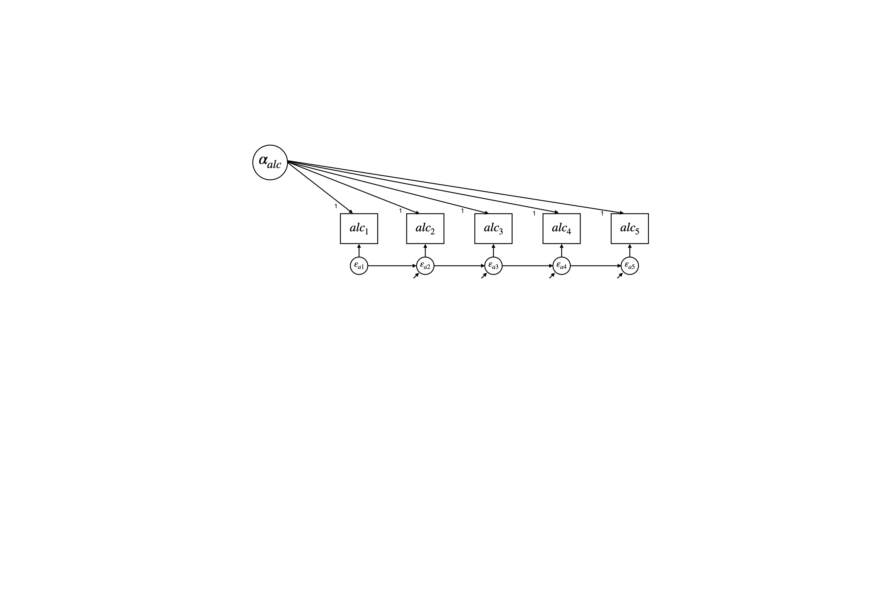
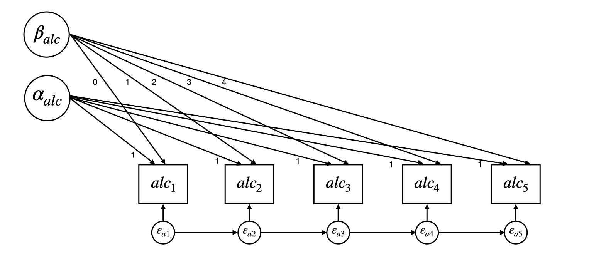

# Latent Curve Model with Structured Residuals
{: .no_toc}
## A tutorial by Jen Traver and Patrick Curran
{: .no_toc}


This tutorial will provide a practical introduction to the application of the latent curve model with structured residuals (LCM-SR), and is designed to accompany [Curran et al., 2014](https://www.ncbi.nlm.nih.gov/pmc/articles/PMC4067471/). Topics covered include:

1. TOC
 {:toc}


{: .note } 
The current tutorial assumes a baseline understanding of the SEM framework and latent curve models (LCMs, also referred to as latent growth models, latent growth curve models, etc.).If you are not familiar with these topics, there are several free resources where you can begin including CenterStat’s [free introduction to SEM workshop](https://centerstat.org/introduction-to-structural-equation-modeling-async/) and [YouTube playlist](https://www.youtube.com/@centerstat/playlists) dedicated to growth modeling.      

**Insert Intro Video Here**
## Background

## When to use the LCM-SR

## Data requirements and assumptions
Number of timepoints, number of observations, types of variables

## Fitting and interpreting LCM-SRs

The following section walks through the models presented in [Curran et al., 2014](https://www.ncbi.nlm.nih.gov/pmc/articles/PMC4067471/) using example data and code made available by Patrick Curran. To follow along in R or MPlus, please use the buttons below to download (1) the data and (2) code in the program of your choice.  
 
<!-- figure out how to best add code since R is all in one file and Mplus is across multiple files --> 
[Download Data](/currandemo.dat){: .btn }
[Download R Code](/LCM-SR.R){: .btn .btn-purple}
[Download MPlus Code](/MPlus){: .btn .btn-green}

### Description of data

The data consists of artificially generated repeated measures data with a sample size of N = 250 and 5 timepionts. More details about the population generating model can be found in Curran et al., 2014. The dataset contains 13 variables:
* id: participant id (1-250)
* gen: biological sex (females = 0, males = 1)
* trt: treatment condition (control = 0, treatment = 1)
* alc1 - alc5: repeated measures of alcohol use
* dep1 - dep5: repeated measures of depression
  
### Model Building Strategy

Although there is no single model building strategy that is optimal for all situations, we will use the following framework:

1. Establish optimal fitting model within each construct separately: for each construct we will (a) determine the optimal functional form of time (linear, quadratic, etc.), (b) test the autoregressions among residuals, and (c) test if the autoregressions are approximately equivalent across time.
2. Estimate a model for both constructs simultaneously: conduct tests of (a) across-construct relationships at the level of the latent variable, (b) across-construct relationships at the level of the time-structured residuals, and (c) equality constraints on the cross-lagged regressions.
3. Expand multivariate model to include predictors of interest

At each step, we will conduct likelihood ratio tests (LRTs) to evaluate the change in model fit. 


[R Tutorial]((https://jmtraver.github.io/lcmsrR.html))


```
model:
     !Define latent intercept (alcint) with indicators of alcohol T1-T5.
     alcint | alc1@1 alc2@1 alc3@1 alc4@1 alc5@1; 

```

<details>
 <summary><h4> Fitting and interpreting models in MPlus</h4></summary>
 <details> 
  <summary> <h5> Step 1: Univariate Unconditional Models </h5></summary>
          <details> <summary> <h6> Alcohol Use </h6></summary>
First, we fit a random-intercept model for alcohol use (see figure 1). Note that this is just a univariate latent curve model, we have not added any structure to the residuals yet. 
 
  <b><i> Figure 1: Intercept-Only Alcohol Use Model</i></b>
  <div></div>

```
model:
     !Define latent intercept (alcint) with indicators of alcohol T1-T5.
     alcint | alc1@1 alc2@1 alc3@1 alc4@1 alc5@1; 

```

  Next, we include a latent slope factor and test whether model fit significantly improves (see Figure 2). 
 
  <b><i> Figure 2: Intercept and Slope Alcohol Use Model</i></b>
  <div></div>

```
model:
     !Define latent intercept (alcint) and latent slope (alcslp)
     alcint alcslp | alc1@0 alc2@1 alc3@2 alc4@3 alc5@4;
```

  Finally, we include structured residuals in our model and test whether these improve model fit (see Figure 3).

<b><i> Figure 3: Intercept, Slope, and Structured Residuals Alcohol Use Model </i></b>

<div></div>

```
model:
     !Define latent intercept (alcint) and latent slope (alcslp)
      alcint alcslp | alc1@0 alc2@1 alc3@2 alc4@3 alc5@4;

     !Regress residual at time T on the prior value of that residual (T-1)
     !Note: the ^ symbol denotes a residual
     alc2^-alc5^ pon alc1^alc4(ar)
  
```
  </details>
          <details> <summary> <h6> Depression </h6></summary></details>
</details>
 
 <details> <summary> <h5> Step 2: Bivariate Unconditional Models </h5></summary></details>
 <details> <summary> <h5> Step 3: Bivariate Conditional Models </h5></summary></details>


 
</details> 


---
