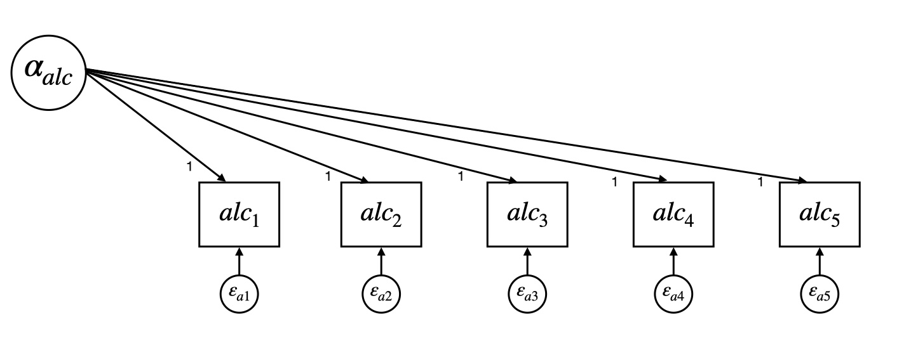

---
---
# Latent Curve Model with Structured Residuals
{: .no_toc}
## A tutorial by Jen Traver and Patrick Curran
{: .no_toc}
<details open markdown = "block">
 <summary> Table of contents 
 </summary>
1. TOC
 {:toc}
</details>

### Overview
The LCM-SR is a structural equation model used to disaggregate the between- and within-person effects of two constructs as they unfold over time. The ability to disaggregate levels of effects is extremely desirable, as it allows researchers to more accurately and fully test their hypotheses. This tutorial will provide a practical introduction to the parameterization and application of the LCM-SR including: 
  
*	Background on the parameterization of the LCM-SR
  
*	Strategies for model building
  
*	How to fit an LCM-SR in R or MPlus
    
*	Interpreting the results of an LCM-SR     

  {: .note }
 The current tutorial assumes a baseline understanding of the SEM framework and latent curve models (LCMs, also referred to as latent growth models, latent growth curve models, etc.).If you are not familiar with these topics, there are several free resources where you can begin including CenterStat’s [free introduction to SEM workshop](https://centerstat.org/introduction-to-structural-equation-modeling-async/) and [YouTube playlist](https://www.youtube.com/@centerstat/playlists) dedicated to growth modeling.
  

### Parameterization of the LCM-SR


### Strategy for Building an LCM-SR 

Although there is no single model building strategy that is optimal for all situations, we will use the following framework:

1. Establish optimal fitting model within each construct separately: for each construct we will (a) determine the optimal functional form of time (linear, quadratic, etc.), (b) test the autoregressions among residuals, and (c) test if the autoregressions are approximately equivalent across time.
2. Estimate a model for both constructs simultaneously: conduct tests of (a) across-construct relationships at the level of the latent variable, (b) across-construct relationships at the level of the time-structured residuals, and (c) equality constraints on the cross-lagged regressions.
3. Expand multivariate model to include predictors of interest

At each step, we will conduct likelihood ratio tests (LRTs) to evaluate the change in model fit. 

### Fitting and interpreting LCM-SRs

The following section walks through the models presented in [Curran et al., 2014](https://www.ncbi.nlm.nih.gov/pmc/articles/PMC4067471/) using example data and code made available by Patrick Curran. To follow along in R or MPlus, please use the buttons below to download (1) the data and (2) code in the program of your choice.  
 
<!-- figure out how to best add code since R is all in one file and Mplus is across multiple files --> 
[Download Data](/currandemo.dat){: .btn }
[Download R Code](/LCM-SR.R){: .btn .btn-purple}
[Download MPlus Code](/MPlus){: .btn .btn-green}

#### Description of data

The data consists of artificially generated repeated measures data with a sample size of N = 250 and 5 timepionts. More details about the population generating model can be found in Curran et al., 2014. The dataset contains 13 variables:
* id: participant id (1-250)
* gen: biological sex (females = 0, males = 1)
* trt: treatment condition (control = 0, treatment = 1)
* alc1 - alc5: repeated measures of alcohol use
* dep1 - dep5: repeated measures of depression

<details>
 <summary><h4> Fitting and interpreting models in MPlus</h4></summary>
 <details> 
  <summary> <h5> Step 1: Univariate Unconditional Models </h5></summary>
          <details> <summary> <h6> Alcohol Use </h6></summary>
First, we fit a random-intercept model for alcohol use (see figure 1). Note that this is just a univariate latent curve model, we have not added any structure to the residuals yet. 

```
model:
     alcint | alc1@1 alc2@1 alc3@1 alc4@1 alc5@1; !Define latent "alcint" variable with indicators of alcohol T1-T5.

```

  <b><i> Figure 1: Intercept-Only Alcohol Use Model</i></b>
  
  <div></div>

  <b><i> Figure 2: Intercept and Slope Alcohol Use Model</i></b>

  <div></div>

  </details>
          <details> <summary> <h6> Depression </h6></summary></details>
</details>
 
 <details> <summary> <h5> Step 2: Bivariate Unconditional Models </h5></summary></details>
 <details> <summary> <h5> Step 3: Bivariate Conditional Models </h5></summary></details>


 
</details> 

<details>
 <summary><h4> Fitting and interpreting models in R </h4></summary>
  <details> 
   <summary> <h5> Step 1: Univariate Unconditional Models </h5></summary>
   <details> <summary> <h6> Alcohol Use </h6></summary>
First, we fit a random-intercept model for alcohol use (see figure 1). Note that this is just a univariate latent curve model, we have not added any structure to the residuals yet.

```


```
  <b><i> Figure 1: Intercept-Only Alcohol Use Model</i></b>  
  <div></div>

</details>

</details>
</details>


 
<h4>Alcohol Use</h4>
First, we fit an intercept-only LCM-SR for alcohol use. 

Initalizing the random intercept:
In R:
```
alc.mod1 <- 'alcint =~ 1*alc1 + 1*alc2 + 1*alc3 + 1*alc4 + 1* alc5 # Define latent "alcint" variable with indicators of alcohol T1 - T5
                 alcint ~ 1 # Indicate that the latent variable alcint is an intercept
                 alcint ~~ alcint #Variance of intercept'
```

Creating the structured residuals:
In R:
```
     '
      #Fix the variances of the repeated measures to 0
      alc1 ~~ 0*alc1
      alc2 ~~ 0*alc2
      alc3 ~~ 0*alc3
      alc4 ~~ 0*alc4
      alc5 ~~ 0*alc5

      #Create "phantom factors" to define the time-specific residuals
      #This is simply a programming trick so in future more complex models we can
      #use the residuals as predictor and outcome variables. 
      salc1 =~ 1*alc1
      salc2 =~ 1*alc2
      salc3 =~ 1*alc3
      salc4 =~ 1*alc4
      salc5 =~ 1*alc5

      #Fix the means of the residuals to 0 for identification
      salc1 ~ 0
      salc2 ~ 0
      salc3 ~ 0
      salc4 ~ 0
      salc5 ~ 0

      #Estimate the variances of the residuals
      salc1 ~~ salc1
      salc2 ~~ salc2
      salc3 ~~ salc3
      salc4 ~~ salc4
      salc5 ~~ salc5'
```

<h5>Intercept & Slope </h5>

```
# random intercept
alc.i =~ 1*alc1 + 1*alc2 + 1*alc3 + 1*alc4 + 1*alc5
alc.i ~ 1
alc.i ~~ alc.i

# random slope
alc.s =~ 0*alc1 + 1*alc2 + 2*alc3 + 3*alc4 + 4*alc5
alc.s ~ 1
alc.s ~~ alc.s
alc.i ~~ alc.s

```


<h4>Depression</h4>


</details>

---
